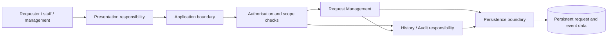
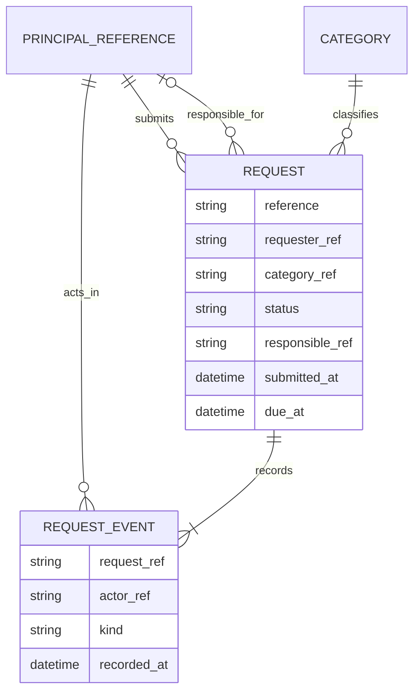

# CivicConnect architecture and data contribution to PED v2.0

Status: proposed for the M2 baseline; not team-approved. This section extends the existing PED without changing the M1 requirements or Tristan's baseline register. The governing evidence is [FR-001 to FR-012](../requirements/functional-requirements.md), [NFR-001 to NFR-005](../requirements/non-functional-requirements.md), the [open requirement details P-01 to P-05](../requirements/decisions-to-confirm.md), and the course Master Brief (SRC-MASTER, sections 2 to 3). The submitted *SEN381 Assignment 2*, Part 2 §2.1 and Part 3 §3, informs the integrity and internal-interaction trade-offs; it is research, not implementation evidence.

## B. Architecturally significant requirements

An ASR below is a requirement or unresolved rule that changes a boundary or an important design choice. It does not add a new requirement. P-01 to P-05 are still proposals on `main`; Tristan's separate M2 change branch proposes their disposition, but that change is not yet integrated here.

| Driver | Existing source | Why it changes the architecture | Architecture and data consequence | Risk or condition |
| --- | --- | --- | --- | --- |
| ASR-01: scoped access | FR-003, FR-005, FR-007, FR-010; NFR-001; P-03 | Every read, mutation and management view can expose protected request information. A hidden UI control cannot enforce the rule. | One server-side authorisation boundary precedes request/history queries and changes; data access must constrain results to the approved scope. Requester and actor references are needed. | The named role/action/data-scope matrix is not approved; deny unspecified access until resolved. |
| ASR-02: attributable, complete history | FR-004, FR-008, FR-009, FR-011; NFR-002 | A successful submission or audited change without its event is incorrect, not merely delayed reporting. | Request changes and their matching history event must be committed as one logical unit. History is read through the same access boundary. | No completed transaction or history test exists in `main`. |
| ASR-03: durable records | FR-001, FR-003, FR-011; NFR-003 | Acknowledged requests and events must survive a controlled application restart. | Persistent storage is required behind an application-owned data boundary; in-memory state alone cannot satisfy the requirement. | Restart is not backup/restore evidence; recovery objectives are open. |
| ASR-04: controlled workflow | FR-007 to FR-010; P-02 | Ownership, status, due date and overdue reporting must use the same rules in every entry point. | Central domain/application rules validate transitions and required information; overdue is derived from status and due date, not another status. | P-02 approval and Liam's status-policy integration remain dependencies. |
| ASR-05: bounded retrieval | FR-005, FR-006, FR-010, FR-012; NFR-005 | Scoped lists, filters, oldest-first ordering and management summaries need predictable data access. | Plan filtered queries and suitable indexes after the database choice and representative data exist. Keep reporting within the authorised request data boundary. | NFR-005's 95%/2-second, ten-user target is proposed, not measured or an estimated demand. |

NFR-004 mainly drives interaction design owned by Liam; it does not justify another service or data store. No throughput, availability percentage or retention period has been supplied, so none is treated as an ASR target.

## B. Architecture alternatives and proposed choice

| Alternative | Fit and benefit | Cost or failure mode | Position |
| --- | --- | --- | --- |
| One undifferentiated layered application | One deployment and simple setup for three developers. | Request rules, permissions and history can become scattered among handlers and storage calls, making NFR-001/002 difficult to verify. | Not chosen as the internal organisation. |
| Modular application server with an explicit presentation boundary | Keeps request workflow, authorisation, history and data access as distinct responsibilities while request changes and history can share a local transaction. Independently testable boundaries without separate service operations. | Modules deploy together; discipline is needed to prevent direct cross-module storage access. | Proposed M2 architecture. |
| Independently deployed request and audit services, or asynchronous history consumer | May later allow independent scaling or external consumers. | Remote/late/duplicate events, partial failures, service security, operating cost and cross-service consistency add work without a current requirement. | Defer; reconsider if a real independent deployment or consumer need appears. |

We propose a modular application server for CivicConnect. This is a **logical architecture decision**, not a decision about React, Node, PostgreSQL, hosting, or the number of deployment tiers. A client/presentation component calls the application boundary. The application boundary authenticates and authorises the action, coordinates request rules and history, and reaches persistence through a data-access responsibility. Request Management owns request state; History/Audit owns the event representation and chronological read. For an audited write they participate in one application operation and one persistence commit boundary. Liam's separate proposed REST browser boundary and in-process internal collaboration are consistent with this shape, but his integration and technology ADRs remain his decisions and await team review.

The diagram shows responsibilities, **not** separate processes, a selected database engine or implemented components. The authorisation check applies to both reads and writes, including history and management queries. The request and event writes belong to the same logical operation; the arrows do not imply two independent commits. No external notification service is shown because P-04 proposes in-app feedback only.

The choice supports ASR-01 to ASR-04 with the fewest extra failure boundaries and leaves ASR-05 as a query/index verification concern. The trade-off is a shared deployment and likely one storage availability boundary. We would revisit the choice if approved requirements require independently deployable consumers, materially different scaling, or external integration. [ADR-001](../decisions/ADR-001-civicconnect-architecture.md) records the decision and alternatives.

### Architecture/persistence baseline contribution

| Ready to put forward for team review | Still outside an approved baseline |
| --- | --- |
| Logical module responsibilities; server-side access boundary; request/history as one audited operation; persistent storage requirement; proposed data ownership, conceptual model and linked permission matrix. | Team approval of the proposed category-scope rules; final status/category/detail approval; Liam's technology and deployment choice; physical schema, indexes and migrations; backup/restore target and procedure; transaction implementation and verification; team sign-off. |

Tristan controls BL-002 and the M2 RTM. This section supplies B/C evidence for incorporation; it does not mark BL-002 approved or alter his records. Relevant current risks are unauthorised disclosure (NFR-001), missing/mismatched history (NFR-002), and storage loss or outage (NFR-003). The unresolved single-store risk should be integrated into the shared Risk Register by its owner, not silently marked resolved here.

## C. Initial data model and ownership

This is a conceptual model, not a physical database schema. Attributes marked *proposed* come from P-01/P-02 and remain subject to their change-control outcome. An identity reference does not assert that CivicConnect owns an account table.

| Data object | Architectural attributes and relationship | Owner and lifecycle | Integrity and sensitivity |
| --- | --- | --- | --- |
| Request | Unique reference; requester identity reference; title, description and approved category (*P-01*); current status, optional responsible staff identity and due date (*P-02*); submission time. One request has a chronological sequence of events. | Request Management; created on valid submission, then follows the agreed transition rules. | Unique reference, valid category/transition, scoped visibility. Description and feedback may be sensitive. FR-001 to FR-010, NFR-001/003. |
| Request event | Request reference, event kind, actor identity reference, time and relevant change/action details; previous/new values where a status or owner changes. | History/Audit defines the event; Request Management coordinates its creation with the matching request change. Events are append-only for ordinary users. | Exactly one corresponding event for each successful audited action; none for a failed action. Event text and actor identity require the request's access scope. FR-004, FR-009, FR-011, NFR-002. |
| Category | Approved category identifier/label (*P-01*); many requests may use one category. | Controlled reference-data owner to be agreed with the team; request submission reads it. | Only approved categories are selectable. Actual list and maintenance role remain open. FR-002/006/010. |
| Principal/actor reference | Stable identity used as requester, responsible staff member or event actor. | Identity source and lifecycle belong to Liam's authentication/design decision; this model stores references, not an invented account implementation. | Authorisation must evaluate the current role and permitted scope; an actor reference alone does not confer access. FR-003/007/011, NFR-001/002. |

`PRINCIPAL_REFERENCE` represents a relationship to an identity source, **not** a selected table. Optional responsible staff and due date are conditional; the diagram cannot express those conditions. Free-text fields and change details are described in the table rather than crowded into the diagram. Submission creates the first event under NFR-002. Tristan's unmerged CR-003 proposes UTC storage and Africa/Johannesburg display for due dates and event times; CR-004 proposes a controlled route that can redact actor/free-text data while retaining the event. Both effects must be reviewed before physical schema sign-off. We make no legal-compliance claim.

### Proposed permission boundary for data design

The [role/action/data-scope matrix](../data/permission-matrix.md) proposes exact core access rules for P-03: a requester sees their own requests and requester-facing feedback; staff read and change requests only in explicitly granted categories; management reads scoped reports, matching lists, detail and history but does not change requests. Missing grants deny access. This category-based interpretation of "approved scope" is **our design proposal**, not a source fact; it can be accepted or changed during pull-request review. Category-grant administration and the conditional CR-004 privacy route remain separate decisions. Liam's authorisation policy must enforce the approved rules at data-access boundaries before NFR-001 can be verified.

## C. Persistence and integrity direction

The access patterns are own-request lookup, permitted staff queue filtered by category/status and oldest-first time, one-request detail/history in chronological order, and scoped management counts/lists with computed overdue. They justify a persistent model with linked request, category and event records and query support for reference, requester/scope, category, status, submission/due times and event order. Exact indexes and physical relationships wait for Liam's database selection and representative data; no demand volume was supplied. In-memory-only state is rejected by NFR-003. A separately committed audit write is rejected by NFR-002. [ADR-002](../decisions/ADR-002-request-history-persistence.md) holds the trade-off without selecting a database engine.

For submission, ownership/status changes and recorded actions, the application checks identity/scope, input and workflow rules before committing the request and its **one** matching event together. If any part fails, neither is acknowledged as successful. A concurrent change must be detected against the persisted current state and returned as a conflict rather than silently overwriting it; after a conflict the caller reloads before a new attempt. Client-side guidance improves usability but is not the integrity boundary. Storage constraints enforce stable references and valid links where the chosen engine permits; business transitions remain in the domain/application rule. This applies the A2 §2.1 comparison to CivicConnect's NFR-002, not its MongoDB-specific transaction example.

One data store and one application instance may be proportionate for the initial educational deployment, but this is an **assumption**, not an availability guarantee. The store is a single point of failure and may become a query bottleneck; history/free-text growth increases storage and query cost. We need a stated recovery/data-loss tolerance, backup and restore procedure with a tested restore before making a recovery claim. NFR-003 proves only controlled restart persistence. Migration/version control and index/load checks follow the chosen technology. We will not add replication or a queue without evidence that these risks warrant their cost.

### Alignment with parallel M2 work (30 September 2026)

Liam's open PR #28 proposes PostgreSQL and a REST browser-to-server boundary. Its backend currently has an in-memory status-change slice, a status policy, an authorisation policy and passing initial checks; it does **not** yet store requests or events in PostgreSQL, use a real authenticated identity, or record history. This confirms the logical workflow boundary but does not satisfy ASR-01 to ASR-03 by itself. If PostgreSQL is accepted at BL-002, the proposed Request, Request Event and Category relationships can be mapped to linked records with a unique request reference, enforced request to event link and one database transaction for an audited change. The precise schema, scope representation, indexes, migration and rollback tests must follow the approved stack and permission matrix; we are not claiming they exist.

Tristan's open PR #27 carries the PED v2 index, RTM, change requests and baseline register. It reserves ADR-001/002 and records the permission matrix as DEP-001; its section map still lists our artefacts as missing because it predates this branch. The section map can name these paths as **proposed** now, with working relative links once the branches are combined. BL-002 remains open until the team's review. His CR-003/004 consequences are reflected above conditionally, not silently treated as approved changes.

## B/C traceability and verification hand-off

| Requirement chain | Proposed responsibility/decision | Artefact now | Initial verification state |
| --- | --- | --- | --- |
| FR-003/005/010 + NFR-001 → ASR-01 | Server-side authorisation before scoped read/write; [proposed role/action/scope matrix](../data/permission-matrix.md) | This PED section; ADR-001; Liam's proposed ADR-005 is on a separate branch | Matrix cases specified for PR review; implementation and tests pending |
| FR-008/009/011 + NFR-002 → ASR-02/04 | Request Management validates, History/Audit records, one persistence commit | This PED section; ADR-001/002; [request/history contract](../data/request-history-contract.md); Liam's status slice in open PR #28 | Status-rule tests exist on Liam's branch; history/transaction checks remain pending |
| FR-001/003/011 + NFR-003 → ASR-03 | Persistent request/event data | This PED section; ADR-002 | Restart and restore evidence pending |
| FR-005/006/010/012 + NFR-005 → ASR-05 | Scoped filtered/ordered queries and computed overdue | This PED section; ADR-002 | Index and performance measurement pending; NFR-005 target remains proposed |

This is our Criterion F technical-documentation contribution and a hand-off contract for implementation. It is **not** a claim that application code, tests, reviews, a migration, or a database are present. Tristan can use these references when updating the RTM; we have not overwritten its structure.
